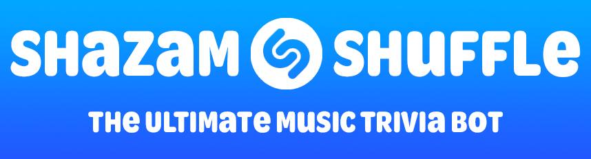
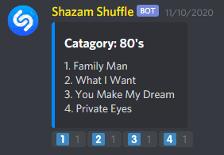

# Shazam Shuffle
> The ultimate music trivia bot for Discord servers

Based off of Fox's Beat Shazam™, Shazam Shuffle is the perfect music trivia game to spice up any Discord server with NEW music being added constantly! Shazam Shuffle is designed to be played over and over and over again with different music everytime.

> Even multiple choice!

# How to play
* Type `s!play` to start a new game
* At the start of the round a song will play. Guess the song correctly by reacting to the one you think is correct and be fast. Bonus points for speed.
* Guess 10 more songs and whoever gets the most correct wins.

# What if I have a question or need more help?
* Feel free to [tweet](https://twitter.com/theguitarleader) or come visit my [Discord Server.](https://discord.gg/KDFzHGK)

# I found a bug, who do I contact?
* Head over to the [issues](https://github.com/TheGuitarleader/MixerLive/issues) page and create a new issue.

# I have a new feature idea!
* Submit feature requests at the [issues](https://github.com/TheGuitarleader/MixerLive/issues) page. Please note that not all feature requests will be implemented.

# Privacy
Shazam Shuffle uses a database to store the music for speed and reliability. In an effort of transparency, here's is all the data that Shazam Shuffle stores:
* __Guild ID__ for knowing what server that a highscore game was played on.
* __User ID__ for knowing what user played a new highscore game.
None of the data described hereafter is being sold to anyone.

In order to help with replayability, when a game is played Shazam Shuffle will:
* Keep track of each song played.
* All correct answers.
* All incorrect answers.
* Games are played on one server.

# Legal Notice
Shazam Shuffle is not affiliated with Shazam, Shazam Entertainment Ltd, or Apple Inc.
All rights belong to their respective owners.